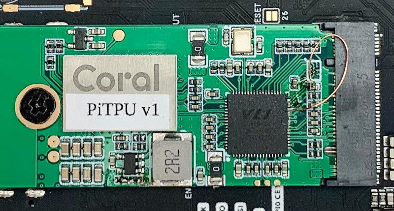

# CM4 Coral m.2 B+M TPU
m.2 B+M Coral TPU card for Raspberry Pi CM4

Coral TPU and Raspberry Pi CM4 are seem to be incompatible over PCIe bus.
This project connects Raspberry Pi CM4 and Coral TPU using VL805 PCIe-to-USB3 IC, same as used in Raspberry Pi 4 in a form factor of m.2 B+M key card

